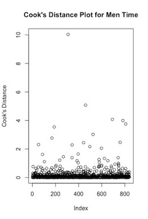
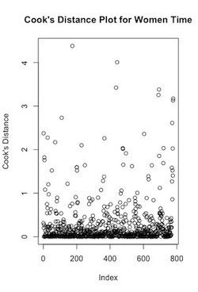

```{r setup, include=FALSE}
knitr::opts_chunk$set(echo = TRUE)
```

In this report we conduct data analysis of marathon times from a sample of elite and sub-elite athletes over the period 2015 to 2019 to analyze whether vaporfly boosts the finish time for professional marathon runners. The data files provided include data regarding the full name, marathon, date, time to finish the marathon, and a binary variable of whether the runner was wearing the vaporfly shoes.

## Executive Summary 

*Rationale* - Nike’s new line of marathon racing shoes, Vaporflys, are considered to provide a significant performance advantage to athletes who wear them.

*Objectives* - The objective of this assignment is to analyze whether the Vaporfly effect is the same for men and women and whether there are any outliers that have undue influence on the results.

*Methods* - The data in this study were collected from 207 distinct women and 308 distinct men, through 21 marathon venues over 2015 to 2019, manually identified whether or not each athlete was wearing Vaporfly shoes. Linear and mixed-effects analyses and log transformation were conducted to test the fixed Vaporfly effect and random effects including runner effect and race effect. To test the effect of Vaporfly on both genders, we calculated the least square means. We plotted the Cook’s distance against the index of the data to assess outliers that can be influencing our results.

*Results* - We deduced that the Vaporfly effect is more significant for male runners compared to female runners. Men runners run 3.13 minutes faster wearing Vaporfly while women runners run 2.29 minutes faster wearing Vaporfly. The Cook’s distance plots show many significant outliers. We may get more accurate parameters by removing these outliers.


## Parameter Estimates

We summarize the notation used for the data below: 

$y_i = \text{marathon time in minutes for performance } i \\ x_i = \begin{cases} 1 \text{ if vaporfly shoes worn in performance } i \\ 0 \text{ if Vaporfly shoes not worn in performance } i \end{cases} \\ j(i) = \text{athlete who completed performance } i \\ k(i) = \text{marathon associated with performance }i$

We further consider the following two models for the performances $y_1, ..., y_n$ to make inferences about the parameters.

$\text{Untransformed: } Y_i = b_0 + b_1x_i + A_{j(i)} + C_{k(i)} + Z_i \\ \text{Transformed: } log(Y_i) = b_0 + b_1x_i + A_{j(i)} + C_{k(i)} + Z_i$

with each of the individual term described below

|  Terms          |  Assumptions         | Description                    |
| ----            |  ----                | ----                           |
| $b_0, b_1$      | Non-random paramters | $b_1 = \text{Vaporfly effect}$ |
| $A_1, ..., A_R$ | $N(0, \sigma_1^2)$   | runner effects                 |
| $C_1, ..., C_R$ | $N(0, \sigma_2^2)$   | marathon effects               |
| $Z_1, ..., Z_R$ | $N(0, \sigma_3^2)$   | residual effects               |

To fit the models, we used the *lmer* function provided by the *lme4* package. We fit seperate models with men and women, and seperate models for the untransformed and log-transformed marathon times. The estimated parameters are summarized below:

|Parameter            |Men minutes (s.e)  |Women Minutes (s.e)  |Men Log Minutes (s.e)  |Women Log Minutes (s.e)    |
| ----                | ----           | ----           | ----           | ----             |
| $b_0$               |139.41(0.43)    |159.45(0.63)    |4.94(0.003)     |5.07 (0.0039)     |
| $b_1$               |-3.12(0.62)     |-2.59(0.83)     |-0.221(0.0042)  |-0.0157 (0.0050)  |
| $\sigma_1$          |4.201           |6.39            |0.030           |0.041             |
| $\sigma_2$          |2.354           |3.17            |0.016           |0.019             |
| $\sigma_3$          |4.112           |5.02            |0.028           |0.030             |

The 90% confidence interval for each of the vaporfly effect is described below. The confidence intervals were constructed using a normal approximation to the sampling distribution of the estimates.

|men minutes     |women minutes   |men log minutes |women log minutes|
| ----           | ----           | ----           | ----            |
|(-4.144, -2.109)|(-3.959, -1.225)|(-0.029, -0.015)|(-0.024, -0.008) |

## The Effect of Vaporfly on Men and Women

From the estimates for $b_1$ in the parameter estimates section we can see that the vaporfly effect is relevant: runners wearing vaporfly will have a faster time compared to runners without the vaporfly. All of the slopes are less than 0. Furthermore, the confidence intervals also support the vaporfly effect as none of the confidence interval contains 0. However, there is overlap between the men's and women's confidence intervals which leaves some uncertainty about which sex benefits most from vaporfly shoes. Therefore, we calculate the least square means for the vaporfly effect on both sex to determine which sex benefits most from vaporfly shoes. The least square mean

To calculate the least square mean, we used the `lsmeans` function in the R programming language. The output of the `lsmeans` function in summarized in the sections below:

### Effect of Vaporfly on Men

|vaporfly|lsmean|Standard Error|Lower Confidence Interval|Upper Confidence Interval|
|----    |----  |----          |----                     |----                     |
|0       |139   |0.432         |138                      |140                      |
|1       |136   |0.660         |135                      |138                      |

|contrast|estimate|SE   |p-value|
|----    |----    |---- |----   |
|0 - 1   |3.13    |0.623|<0.001 |

### Effect of Vaporfly on Women

|vaporfly|lsmean|Standard Error|Lower Confidence Interval|Upper Confidence Interval|
|----    |----  |----          |----                     |----                     |
|0       |159   |0.628         |158                      |161                      |
|1       |157   |0.942         |155                      |150                      |

|contrast|estimate|SE   |p-value|
|----    |----    |---- |----   |
|0 - 1   |2.59    |0.836|<0.002 |


From the tables above, we can deduce that the vaporfly effect is more significant for male runners compared to female runners. For men runners wearing vaporfly will run 3.13 minutes faster than runners who are not wearing vaporfly; whereas, for women, runners wearing vaporfly will run 2.29 minutes faster than runners who are not. Both least square means are statistically significant as the p-value is less than 1%. 


## Exploration of Outliers

To conduct further analysis on the vaporfly dataset, we check for outliers. We plot the Cook's distance against the index of the data to assess outliers that can be influencing our results.

Cook's distance is an index of how much a point changes the estimated regression parameters when a point is included in the regression compared to when the point is not included in the regression. In other words, Cook's distance is a direct measure of a single data point's influence on the estimated regression parameter. Points with Cook's Distances greater than 1 are influencing the estimated regression. 

The Cook's distance can be found using the equation $D_i = \frac{1}{\text{MSE}} \sum{\hat{y_j} - \hat{y_{j(i)}}}$ where $\hat{y_j}$ is the predicted value of the jth y with point *i* in the regression and $\hat{y_{j(i)}}$ is the predicted value without the ith point included.

The Cook's distance plot for both women and men time are shown below:

 

The Cook's ditance plot for both men and women time shows many significant outliers as the Cook's distance value is greater than 1. By removing the corresponding points, we may get regression parameters that reflect the population parameters better; however, we would have to critically access whether the outliers are due to systematic errors, or that there are runners who are significantly faster than the other runners in which we should not remove the outliers.